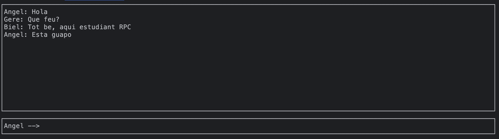

# RPC Chat
## Distribuida - RPC Chat using RPCGEN

To compile the project, run make:
```bash
make
```

<br>

Once compiled, run the server:
```bash
./server
```

<br>

With the server running, run all clients you want:
```bash
./client 127.0.0.1 Angel
```
```bash
./client 127.0.0.1 Biel
```
```bash
./client 127.0.0.1 Gere
```

<br>

They will be able to have a chat between them, with an ncurses UI:



<br>

### Authors
Angel Garcia ([angel.garcia@students.salle.url.edu](mailto:angel.garcia@students.salle.url.edu))

Biel Carpi ([biel.carpi@students.salle.url.edu](mailto:biel.carpi@students.salle.url.edu))